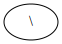

Backslash escapes
-----------------

The Graphviz_ layout `engines <DOT layouts_>`_ support a number of
`escape sequences <DOT escString_>`_ such as ``\n``, ``\l``, ``\r``
(for placement of multi-line labels:
*centered*, *left*-justified, *right*-justified)
and ``\N``, ``\G``, ``\L``
(expanded to the current *node* name, *graph* name, object *label*).
To be able to use them from this library (e.g., for labels),
backslashes  in strings are (mostly) passed on **as is**.

.. attention::

    This means that **literal** backslashes need to be **escaped** (doubled) by the user.
    As the backslash is also special in Python :class:`string <str>` literals
    a **second** level of doubling is needed.
    E.g. ``label='\\\\'`` for a label that is rendered as single literal backlash: ``\``.

.. tip::

    Doubling of backslashes can be avoided by using `raw string literals`_
    (``r'...'``) instead.
    This is similar to the solution proposed for the stdlib :mod:`re` module.
    See also https://en.wikipedia.org/wiki/Leaning_toothpick_syndrome.

.. doctest::

    >>> import graphviz  # doctest: +NO_EXE

    >>> e = graphviz.Digraph('escapes')

    >>> e.node('backslash', label=r'\\')
    >>> e.node('multi_line', label=r'centered\nleft\lright\r')

    >>> print(e.source)  # doctest: +NORMALIZE_WHITESPACE
    digraph escapes {
        backslash [label="\\"]
        multi_line [label="centered\nleft\lright\r"]
    }
    <BLANKLINE>

.. image:: _static/escapes.svg
    :align: center

To disable any special character meaning in a string
(e.g. from user input to be rendered literally),
use the :func:`graphviz.escape` function
(similar to the :func:`re.escape` function):

.. doctest::

    >>> bs = graphviz.Digraph('literal_backslash')  # doctest: +NO_EXE

    >>> bs.node(graphviz.escape('\\'))

    >>> print(bs.source)  # doctest: +NORMALIZE_WHITESPACE
    digraph literal_backslash {
        "\\"
    }
    <BLANKLINE>

.. doctest::

    >>> doctest_mark_exe()  # skip this line

    >>> bs.render(format='svg', directory='doctest-output').replace('\\', '/')
    'doctest-output/literal_backslash.gv.svg'

.. admonition:: Historical note

    To prevent breaking the internal quoting mechanism, the special meaning
    of ``\"`` as a backslash-escaped quote has been disabled
    since version ``0.14`` of this library.
    E.g. both ``label='"'`` and ``label='\\"'``
    now produce the same DOT source ``[label="\""]``
    (a label that renders as a literal quote).
    See also `examples/graphviz-escapes.ipynb <GitHub graphviz-escapes.ipynb_>`_
    (`nbviewer <nbviewer graphviz-escapes.ipynb_>`_).

.. include:: _links.rst
