.. _examples:

Examples
========

The following code examples are included in the ``examples/`` directory of the
`source repository/distribution`__. Most of them recreate examples from the
`graphviz.org gallery`__ or the `graphviz.org documentation`__.

.. __: https://github.com/xflr6/graphviz/tree/master/examples/
.. __: http://www.graphviz.org/gallery/
.. __: http://www.graphviz.org/documentation/

hello.py 
--------

.. literalinclude:: ../examples/hello.py
    :lines: 2-

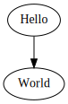

process.py
----------

.. literalinclude:: ../examples/process.py
    :lines: 2-

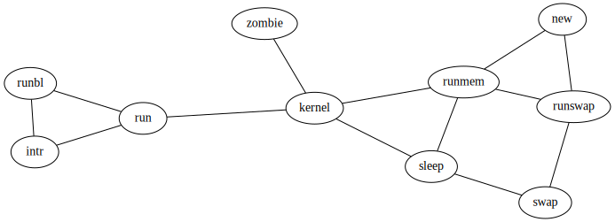

fsm.py
------

.. literalinclude:: ../examples/fsm.py
    :lines: 2-

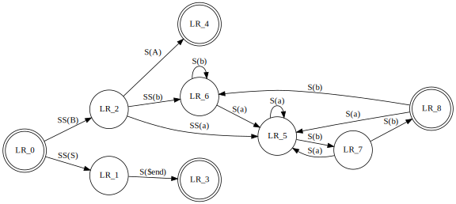

.. _cluster.py:

cluster.py
----------

.. literalinclude:: ../examples/cluster.py
    :lines: 2-

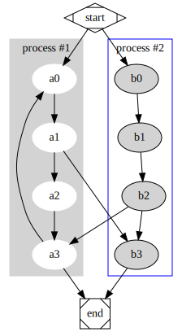

er.py
-----

.. literalinclude:: ../examples/er.py
    :lines: 2-

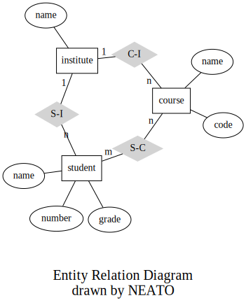

unix.py
-------

.. literalinclude:: ../examples/unix.py
    :lines: 2-

.. image:: _static/unix.svg
    :align: center

structs.py
----------

.. literalinclude:: ../examples/structs.py
    :lines: 2-

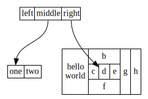

structs_revisited.py
--------------------

.. literalinclude:: ../examples/structs_revisited.py
    :lines: 2-

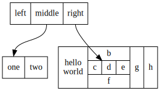

btree.py
--------

.. literalinclude:: ../examples/btree.py
    :lines: 2-

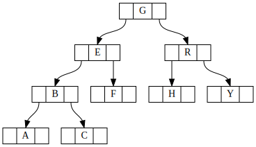

traffic_lights.py
-----------------
.. literalinclude:: ../examples/traffic_lights.py
    :lines: 2-

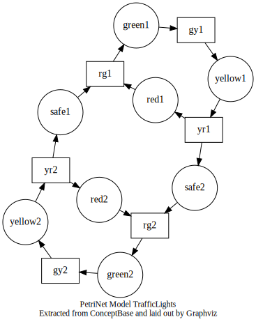

fdpclust.py
-----------
.. literalinclude:: ../examples/fdpclust.py
    :lines: 2-

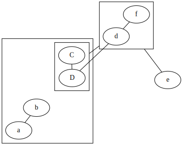

cluster_edge.py
---------------
.. literalinclude:: ../examples/cluster_edge.py
    :lines: 2-

.. image:: _static/cluster_edge.svg
    :align: center

g_c_n.py
--------
.. literalinclude:: ../examples/g_c_n.py
    :lines: 2-

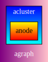

angles.py
---------
.. literalinclude:: ../examples/angles.py
    :lines: 2-

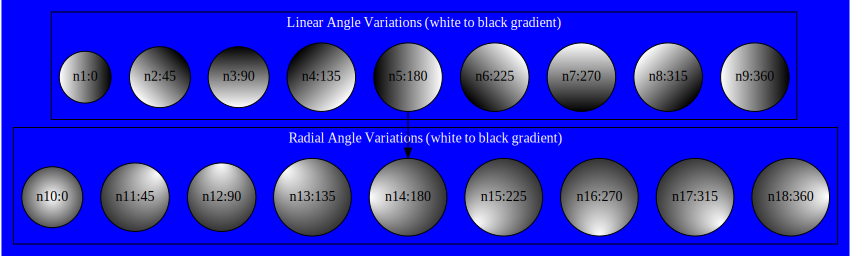
