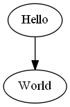
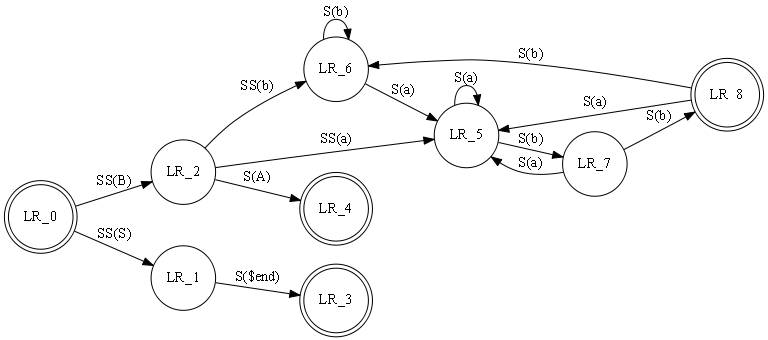
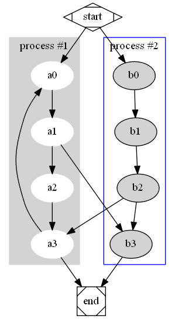
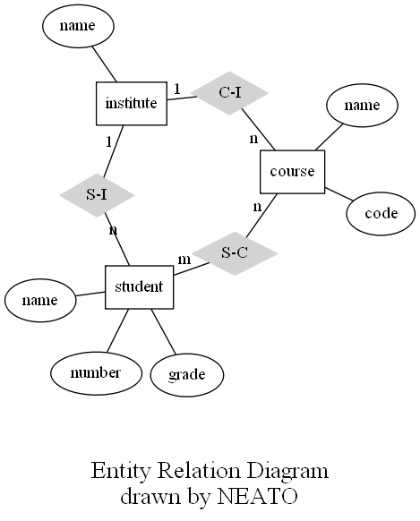
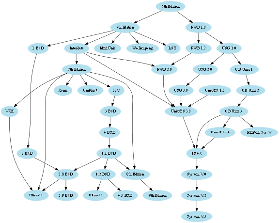
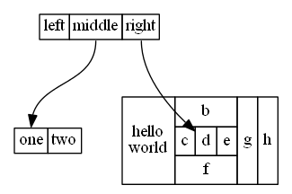

.. _examples:

Examples
========

See the ``examples`` directory in the `source repository/distribution`__.

.. __: http://github.com/xflr6/graphviz/tree/master/examples/

hello.py 
--------

.. literalinclude:: ../examples/hello.py
    :lines: 2-

process.py
----------

.. literalinclude:: ../examples/process.py
    :lines: 2-

.. image:: _static/process.png
    :align: center

fsm.py
------

.. literalinclude:: ../examples/fsm.py
    :lines: 2-

cluster.py
----------

.. literalinclude:: ../examples/cluster.py
    :lines: 2-

er.py
-----

.. literalinclude:: ../examples/er.py
    :lines: 2-

unix.py
-------

.. literalinclude:: ../examples/unix.py
    :lines: 2-

structs.py
----------

.. literalinclude:: ../examples/structs.py
    :lines: 2-

