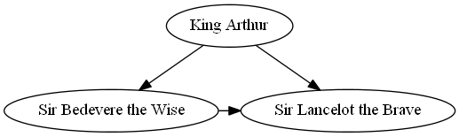
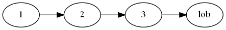

.. _manual:

User Guide
==========

Installation
------------

``graphviz`` provides a simple pure-python interface for the Graphviz_
graph-drawing software. It runs under both Python 2.7 and 3.3+. To install it
with pip_ run the following:

.. code:: bash

    $ pip install graphviz

For a system-wide install, this typically requires administrator access. For an
isolated install, you can run the same inside a virtualenv_.

The only dependency is a working installation of Graphviz (`download page`_).

After installing Graphiz, make sure that its ``bin/`` subdirectory containing
the layout commands for rendering graph descriptions (``dot``, ``circo``,
``neato``, etc.) is on your systems' path: On the command-line, ``dot -V``
should print the version of your Graphiz installation.

Basic usage
-----------

The ``graphviz`` module provides two classes: :py:class:`~graphviz.Graph` and
:py:class:`~graphviz.Digraph`. They create graph descriptions in the DOT_
language for undirected and directed graphs respectively. They have the same
API.

Create a graph by instantiating a new :py:class:`~graphviz.Graph` or
:py:class:`~graphviz.Digraph` object:

.. code:: python

    >>> from graphviz import Digraph

    >>> dot = Digraph(comment='The Round Table')

    >>> dot  #doctest: +ELLIPSIS
    <graphviz.dot.Digraph object at 0x...>

Their constructors allow to set the graph's ``name``, the ``filename`` for the
DOT source and the rendered graph, a ``comment`` for the first source code
line, etc.

Add nodes and edges using the ``node`` and ``edge`` or ``edges`` methods:

.. code:: python

    >>> dot.node('A', 'King Arthur')
    >>> dot.node('B', 'Sir Bedevere the Wise')
    >>> dot.node('L', 'Sir Lancelot the Brave')

    >>> dot.edges(['AB', 'AL'])
    >>> dot.edge('B', 'L', constraint='false')

The ``node``-method take a ``name`` identifier as first argument and an
optional ``label``. The ``edge``-method takes the names of start- and end-node,
while ``edges`` takes iterable of name-pairs. Keyword arguments are turned into
(node and edge) attributes (see `Graphviz docs <appearance_>`_).

Check the generated source code:

.. code:: python

    >>> print(dot.source)  # doctest: +NORMALIZE_WHITESPACE
    // The Round Table
    digraph {
        A [label="King Arthur"]
        B [label="Sir Bedevere the Wise"]
        L [label="Sir Lancelot the Brave"]
            A -> B
            A -> L
            B -> L [constraint=false]
    }

Use the ``render``-method to save the source code and render it with the
default layout program.

.. code:: python

    >>> dot.render('test-output/round-table.gv', view=True)
    'test-output/round-table.gv.pdf'

Passing ``view=True`` will automatically open the resulting (PDF, PNG, SVG,
etc.) file with your system's default viewer application for the file type.

Formats
-------

To use a different `output file format`_ than the default PDF, set the
``format`` argument when creating your :py:class:`~graphviz.Graph` or
:py:class:`~graphviz.Digraph` object:

.. code:: python

    >>> from graphviz import Graph

    >>> g = Graph(format='png')

You can also change the ``format`` attribute on an existing graph object:

.. code:: python

    >>> dot.format = 'svg'

    >>> dot.render()
    'test-output/round-table.gv.svg'

Piped output
------------

To directly access the results from the Graphviz rendering command (e.g.
``dot``) as binary data string from within Python instead of writing to a file,
use the ``pipe()``-method of your :py:class:`~graphviz.Graph` or
:py:class:`~graphviz.Digraph` object:

.. code:: python

    >>> h = Graph('hello', format='svg')

    >>> h.edge('Hello', 'World')

    >>> print(h.pipe().decode('utf-8'))  # doctest: +NORMALIZE_WHITESPACE +ELLIPSIS
    <?xml version="1.0" encoding="UTF-8" standalone="no"?>
    <!DOCTYPE svg
    ...
    </svg>

Note that ``pipe()`` returns the raw ``stdout`` from the rendering command
(``str`` on Python 2, ``bytes`` on Python 3): When piping into plain-text
formats like ``svg`` or ``plain``, you usually want to decode the return value
as shown above.

.. note::

    The output for ``pipe()`` is buffered in memory, so do not use this method
    if the data size is large.

IPython notebooks
-----------------

:py:class:`~graphviz.Graph` and :py:class:`~graphviz.Digraph` objects have a
``_repr_svg_``-method so they can be rendered and displayed directly inside an
IPython notebook. For an example, see the ``examples/notebook.ipynb`` in the
`source repository/distribution`__.

__ http://nbviewer.ipython.org/github/xflr6/graphviz/blob/master/examples/notebook.ipynb

Styling
-------

Use the ``graph_attr``, ``node_attr``, and ``edge_attr`` arguments to change
the default appearance_ of your graph, nodes, and edges.

.. code:: python

    >>> dot = Digraph(name='pet-shop', node_attr={'shape': 'plaintext'})

    >>> dot.node('parrot')
    >>> dot.node('dead')
    >>> dot.edge('parrot', 'dead')

After creation, they can be edited on the graph object:

.. code:: python

    >>> dot.graph_attr['rankdir'] = 'LR'
    >>> dot.edge_attr.update(arrowhead='vee', arrowsize='2')

    >>> print(dot.source)  # doctest: +NORMALIZE_WHITESPACE
    digraph "pet-shop" {
        graph [rankdir=LR]
        node [shape=plaintext]
        edge [arrowhead=vee arrowsize=2]
            parrot
            dead
                parrot -> dead
    }

.. image:: _static/pet-shop.png
    :align: center

Engines
-------

To use a different layout command than the default ``dot`` when rendering your
graph, set the ``engine`` argument on graph creation. 

.. code:: python

    >>> g = Graph(engine='neato')

You can also change the ``engine`` attribute of an existing instance:

.. code:: python

    >>> dot.engine = 'circo'

Using raw DOT
-------------

To render a ready-made DOT source code string (instead of assembling one with
the higher-level interface of :py:class:`~graphviz.Graph` or
:py:class:`~graphviz.Digraph`), create a :py:class:`~graphviz.Source` object
holding your DOT string:

.. code:: python

    >>> from graphviz import Source

    >>> src = Source('digraph "the holy hand grenade" { rankdir=LR; 1 -> 2 -> 3 -> lob }')

    >>> src  #doctest: +ELLIPSIS
    <graphviz.files.Source object at 0x...>

Use the ``render``-method to save and render it:

.. code:: python

    >>> src.render('test-output/holy-grenade.gv', view=True)
    'test-output/holy-grenade.gv.pdf'

Apart from the missing editing methods, :py:class:`~graphviz.Source` objects
are the same as the higher-level graph objects (``pipe()``-method, formats,
engines, IPython notebook repr, etc.), see above.

.. _pip: http://pip.readthedocs.org
.. _virtualenv: http://virtualenv.pypa.io

.. _Graphviz:  http://www.graphviz.org
.. _download page: http://www.graphviz.org/Download.php
.. _DOT: http://www.graphviz.org/doc/info/lang.html
.. _output file format: http://www.graphviz.org/doc/info/output.html
.. _appearance: http://www.graphviz.org/doc/info/attrs.html
