.. _manual:

User Guide
==========

Installation
------------

:mod:`graphviz` provides a simple pure-Python interface for the Graphviz_
graph-drawing software. It runs under Python 3.6+. To install it with pip_, run
the following:

.. code:: bash

    $ pip install graphviz

For a system-wide install, this typically requires administrator access. For an
isolated install, you can run the same inside a :mod:`py3:venv` or a
virtualenv_.

The only dependency is a working installation of Graphviz_
(`download page <upstream-download_>`_,
`archived versions <upstream-archived_>`_,
`installation procedure for Windows <upstream-windows_>`_).

After installing Graphviz, make sure that its ``bin/`` subdirectory containing
the layout commands for rendering graph descriptions (``dot``, ``circo``,
``neato``, etc.) is on your systems' path: On the command-line, ``dot -V``
should print the version of your Graphiz installation.

.. hint::

    Windows users might want to check the status of known issues
    (gvedit.exe__, sfdp__, commands__) and consider trying an older archived
    version as a workaround (e.g. graphviz-2.38.msi__).

    __ https://gitlab.com/graphviz/graphviz/-/issues/1816
    __ https://gitlab.com/graphviz/graphviz/-/issues/1269
    __ https://gitlab.com/graphviz/graphviz/-/issues/1753
    __ https://www2.graphviz.org/Archive/stable/windows/graphviz-2.38.msi

Anaconda_: see the conda-forge_ package
`conda-forge/python-graphviz <conda-forge-python-graphviz_>`_
(`feedstock <conda-forge-python-graphviz-feedstock_>`_),
which should automatically ``conda install``
`conda-forge/graphviz <conda-forge-graphviz_>`_
(`feedstock <conda-forge-graphviz-feedstock_>`_) as dependency.

Basic usage
-----------

The :mod:`graphviz` module provides two classes: :class:`.Graph` and
:class:`.Digraph`. They create graph descriptions in the DOT_ language for
undirected and directed graphs respectively. They have the same
:ref:`API <api>`.

Create a graph by instantiating a new :class:`.Graph` or
:class:`.Digraph` object:

.. code:: python

    >>> import graphviz

    >>> dot = graphviz.Digraph(comment='The Round Table')

    >>> dot  #doctest: +ELLIPSIS
    <graphviz.dot.Digraph object at 0x...>

Their constructors allow to set the graph's :attr:`~.Graph.name`, the
:attr:`~.Graph.filename` for the DOT source and the rendered graph, a
:attr:`~.Graph.comment` for the first source code line, etc.

Add nodes and edges to the graph object using its :meth:`~.Graph.node` and
:meth:`~.Graph.edge`- or :meth:`~.Graph.edges`-methods:

.. code:: python

    >>> dot.node('A', 'King Arthur')
    >>> dot.node('B', 'Sir Bedevere the Wise')
    >>> dot.node('L', 'Sir Lancelot the Brave')

    >>> dot.edges(['AB', 'AL'])
    >>> dot.edge('B', 'L', constraint='false')

The :meth:`~.Graph.node`-method takes a ``name`` identifier as first argument
and an optional ``label``. The :meth:`~.Graph.edge`-method takes the names of
start node and end node, while :meth:`~.Graph.edges` takes an iterable of
name pairs. Keyword arguments are turned into (node and edge) attributes (see
`Graphviz docs <appearance_>`_ on available attributes).

Check the generated source code:

.. code:: python

    >>> print(dot.source)  # doctest: +NORMALIZE_WHITESPACE
    // The Round Table
    digraph {
        A [label="King Arthur"]
        B [label="Sir Bedevere the Wise"]
        L [label="Sir Lancelot the Brave"]
        A -> B
        A -> L
        B -> L [constraint=false]
    }

Use the :meth:`~.Graph.render`-method to save the source code and render it with the
default layout program (``dot``, see below for using `other layout commands
<Engines_>`_). 

.. code:: python

    >>> dot.render('test-output/round-table.gv', view=True)  # doctest: +SKIP
    'test-output/round-table.gv.pdf'

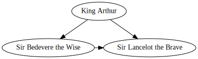

Passing ``view=True`` will automatically open the resulting (PDF, PNG, SVG,
etc.) file with your system's default viewer application for the file type.

Formats
-------

To use a different `output file format`_ than the default PDF, use the
:attr:`~.Graph.format` argument when creating your :class:`.Graph` or
:class:`.Digraph` object:

.. code:: python

    >>> g = graphviz.Graph(format='png')

You can also change the :attr:`~.Graph.format` attribute on an existing graph
object:

.. code:: python

    >>> dot.format = 'svg'

    >>> dot.render()  # doctest: +SKIP
    'test-output/round-table.gv.svg'

Piped output
------------

To directly access the results from the Graphviz rendering command (e.g.
``dot``) as binary data string from within Python instead of writing to a file,
use the :meth:`~.Graph.pipe`-method of your :class:`.Graph` or
:class:`.Digraph` object:

.. code:: python

    >>> h = graphviz.Graph('hello', format='svg')

    >>> h.edge('Hello', 'World')

    >>> print(h.pipe().decode('utf-8'))  # doctest: +NORMALIZE_WHITESPACE +ELLIPSIS
    <?xml version="1.0" encoding="UTF-8" standalone="no"?>
    <!DOCTYPE svg
    ...
    </svg>

Note that :meth:`~.Graph.pipe` returns the raw ``stdout`` from the rendering
command (``str`` on Python 2, ``bytes`` on Python 3): When piping into
plain-text formats like ``'svg'`` or ``'plain'``, you usually want to decode
the return value as shown above.

.. note::

    The output for :meth:`~.Graph.pipe` is buffered in memory, so do not use
    this method if the data size is large.

Jupyter notebooks
-----------------

:class:`.Graph` and :class:`.Digraph` objects have a
:meth:`~.Graph._repr_svg_`-method so they can be rendered and displayed
directly inside a `Jupyter notebook`_. For an example, check the
``examples/graphviz-notebook.ipynb`` file in the
`source repository/distribution <graphviz-notebook.ipynb_>`_ (or the same
rendered within nbviewer_).

This also allows direct displaying within the `Jupyter Qt Console`_ (e.g.
`the one <spyderconsole_>`_ inside `Spyder IDE`_):

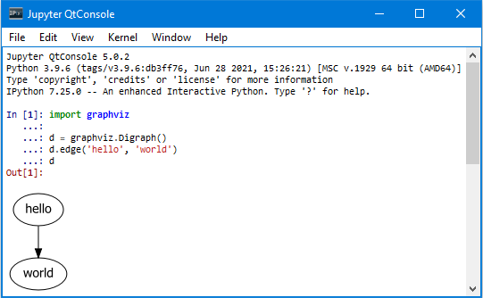

Styling
-------

Use the :attr:`~.Graph.graph_attr`, :attr:`~.Graph.node_attr`, and
:attr:`~.Graph.edge_attr` arguments to change the default appearance_ of your
graph, nodes, and edges.

.. code:: python

    >>> ps = graphviz.Digraph(name='pet-shop', node_attr={'shape': 'plaintext'})

    >>> ps.node('parrot')
    >>> ps.node('dead')
    >>> ps.edge('parrot', 'dead')

After creation, they can be edited on the graph object:

.. code:: python

    >>> ps.graph_attr['rankdir'] = 'LR'
    >>> ps.edge_attr.update(arrowhead='vee', arrowsize='2')

    >>> print(ps.source)  # doctest: +NORMALIZE_WHITESPACE
    digraph "pet-shop" {
        graph [rankdir=LR]
        node [shape=plaintext]
        edge [arrowhead=vee arrowsize=2]
        parrot
        dead
        parrot -> dead
    }

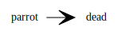

.. _attributes:

Attributes
----------

To directly add attritbute statements (affecting all following graph, node, or
edge items within the same (sub-)graph), use the :meth:`~.Graph.attr`-method
with the target as first argument:

.. code:: python

    >>> ni = graphviz.Graph('ni')

    >>> ni.attr('node', shape='rarrow')
    >>> ni.node('1', 'Ni!')
    >>> ni.node('2', 'Ni!')

    >>> ni.node('3', 'Ni!', shape='egg')

    >>> ni.attr('node', shape='star')
    >>> ni.node('4', 'Ni!')
    >>> ni.node('5', 'Ni!')

By omitting its first argument, you can use it to set arbitrary attributes as
key-value pairs targeting the current (sub-)graph (e.g. for ``rankdir``,
``label``, or setting ``rank='same'`` within a subgraph context,
:ref:`example <rank_same.py>`):

.. code:: python

    >>> ni.attr(rankdir='LR')

    >>> ni.edges(['12', '23', '34', '45'])

    >>> print(ni.source)  # doctest: +NORMALIZE_WHITESPACE
    graph ni {
        node [shape=rarrow]
        1 [label="Ni!"]
        2 [label="Ni!"]
        3 [label="Ni!" shape=egg]
        node [shape=star]
        4 [label="Ni!"]
        5 [label="Ni!"]
        rankdir=LR
        1 -- 2
        2 -- 3
        3 -- 4
        4 -- 5
    }

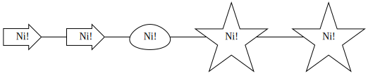

.. _ports:

Node ports & compass
--------------------

The :meth:`~.Graph.edge`- and :meth:`~.Graph.edges`-methods use the
colon-separated format ``node[:port[:compass]]`` for ``tail`` and ``head``
nodes. This allows to specify an optional node ``port`` plus an optional
``compass`` point the edge should aim at for the given tail or head node
(:ref:`example <btree.py>`).

As colons are used to indicate ``port`` and ``compass``, node names with
literal colon(s) (``:``) are not supported. Note that there is no such
restriction for the ``label`` argument, so you can work around by choosing a
colon-free ``name`` together with the wanted ``label``:

.. code:: python

    >>> cpp = graphviz.Digraph('C++')
    
    >>> cpp.node('A', 'std::string')
    >>> cpp.node('B', '"spam"')
    
    >>> cpp.edge('A', 'B')
    
    >>> print(cpp.source)  # doctest: +NORMALIZE_WHITESPACE
    digraph "C++" {
        A [label="std::string"]
        B [label="\"spam\""]
        A -> B
    }

Backslash escapes
-----------------

The Graphviz layout engine supports a number of
`escape sequences <escString_>`_ such as ``\n``, ``\l``, ``\r`` (for multi-line
labels: centered, left-justified, right-justified) and ``\N``, ``\G``, ``\L``
(expanded to the current node name, graph name, object label). To be able to
use them from this library (e.g. for labels), strings with backslashes are
passed on as is. This means that literal backslashes need to be escaped
(doubled) by the user. As the backslash is also special in Python string
literals, a second level of doubling is needed (e.g. ``label='\\\\'``). This
kind of doubling can be avoided by using `raw string literals`_ (``r'...'``)
instead (same solution as proposed for the stdlib :mod:`re` module):

.. code:: python

    >>> e = graphviz.Digraph()

    >>> e.node('backslash', label=r'\\')
    >>> e.node('multi_line', label=r'centered\nleft\lright\r')

    >>> print(e.source)  # doctest: +NORMALIZE_WHITESPACE
    digraph {
        backslash [label="\\"]
        multi_line [label="centered\nleft\lright\r"]
    }

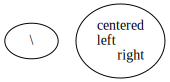

To disable any special character meaning in a string (e.g. from user input to
be rendered literally), use the :func:`.escape` function (cf. the
:func:`re.escape` function):

.. code:: python

    >>> bs = graphviz.Digraph()

    >>> bs.node(graphviz.escape('\\'))

    >>> print(bs.source)  # doctest: +NORMALIZE_WHITESPACE
    digraph {
        "\\"
    }

.. note::

    To prevent breaking the internal quoting mechanism, the special meaning of
    ``\"`` as a backslash-escaped quote has been disabled since version
    ``0.14``. E.g. both ``label='"'`` and ``label='\\"'`` now produce the same
    DOT source ``[label="\""]`` (a label that renders as a literal quote).

Quoting and HTML-like labels
----------------------------

The graph-building methods of :class:`.Graph` and :class:`.Digraph` objects
automatically take care of quoting (and escaping quotes)
`where needed <DOT_>`_ (whitespace, keywords, double quotes, etc.):

.. code:: python

    >>> q = graphviz.Digraph()

    >>> q.edge('spam', 'eggs eggs')
    >>> q.edge('node', '"here\'s a quote"')

    >>> print(q.source)  # doctest: +NORMALIZE_WHITESPACE
    digraph {
        spam -> "eggs eggs"
        "node" -> "\"here's a quote\""
    }

If a string starts with ``'<'`` and ends with ``'>'``, it is passed on as is,
without quoting/escaping: The content between the angle brackets is treated by
the engine as special **HTML string** that can be used for `HTML-like labels`_:

.. code:: python

    >>> h = graphviz.Graph('html_table')

    >>> h.node('tab', label='''<<TABLE>
    ...  <TR>
    ...    <TD>left</TD>
    ...    <TD>right</TD>
    ...  </TR>
    ... </TABLE>>''')

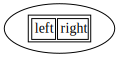

For strings that should literally begin with ``'<'`` and end with ``'>'``, use
the :func:`.nohtml` function to disable the special meaning of angled
parenthesis and apply normal quoting/escaping (before ``0.8.2``, the only
workaround was to add leading or trailing space, e.g. ``label=' <>'``):

.. code:: python

    >>> d = graphviz.Digraph(format='svg')

    >>> d.node('diamond', label=graphviz.nohtml('<>'))

    >>> print(d.source)  # doctest: +NORMALIZE_WHITESPACE
    digraph {
        diamond [label="<>"]
    }

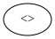

.. _subgraphs:

Subgraphs & clusters
--------------------

:class:`.Graph` and :class:`.Digraph` objects have a
:meth:`~.Graph.subgraph`-method for adding a subgraph to an instance.

There are two ways to use it: Either with a ready-made graph object of the same
kind as the only argument (whose content is added as a subgraph) or omitting
the ``graph`` argument (returning a context manager for defining the subgraph
content more elegantly within a ``with``-block).

First usage option, with ``graph`` as the only argument:

.. code:: python

    >>> p = graphviz.Graph(name='parent')
    >>> p.edge('spam', 'eggs')

    >>> c = graphviz.Graph(name='child', node_attr={'shape': 'box'})
    >>> c.edge('foo', 'bar')

    >>> p.subgraph(c)

Second usage, with a ``with``-block (omitting the ``graph`` argument):

.. code:: python

    >>> p = graphviz.Graph(name='parent')
    >>> p.edge('spam', 'eggs')

    >>> with p.subgraph(name='child', node_attr={'shape': 'box'}) as c:
    ...    c.edge('foo', 'bar')

Both produce the same result:

.. code:: python

    >>> print(p.source)  # doctest: +NORMALIZE_WHITESPACE
    graph parent {
        spam -- eggs
        subgraph child {
            node [shape=box]
            foo -- bar
        }
    }

.. note::

    If the ``name`` of a subgraph begins with ``'cluster'`` (all lowercase) the
    layout engine will treat it as a special cluster subgraph
    (:ref:`example <cluster.py>`). Also see the `Subgraphs and Clusters`
    section of `the DOT language documentation <DOT_>`_.

When :meth:`~.Graph.subgraph` is used as a context manager, the new graph
instance  is created with ``strict=None`` and the parent graph's values for
``directory``, ``format``, ``engine``, and ``encoding``. Note that these
attributes are only relevant when rendering the subgraph independently
(i.e. as a stand-alone graph) from within the ``with``-block:

.. code:: python

    >>> p = graphviz.Graph(name='parent')

    >>> with p.subgraph(name='child') as c:
    ...    c.edge('bacon', 'eggs')
    ...    c.render()  # doctest: +SKIP
    'child.gv.pdf'

Engines
-------

To use a different layout command than the default ``dot`` when rendering your
graph, use the :attr:`~.Graph.engine` argument when creating your graph. 

.. code:: python

    >>> g = graphviz.Graph(engine='neato')

You can also change the :attr:`~.Graph.engine` attribute of an existing
instance:

.. code:: python

    >>> dot.engine = 'circo'

Unflatten
---------

To prepocess the DOT_ source of a :class:`.Graph` or :class:`.Digraph` with
the unflatten_ preprocessor (`PDF <unflatten_pdf_>`_), use the
:meth:`~.Graph.unflatten`-method.

.. code:: python

    >>> w = graphviz.Digraph()

    >>> w.edges(('0', str(i)) for i in range(1, 10))

    >>> w.view()  # doctest: +SKIP

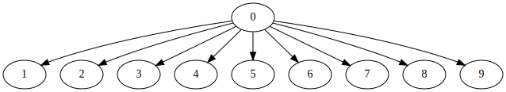

unflatten_ is used to improve the aspect ratio of graphs having many leaves or
disconnected nodes.

.. code:: python

    >>> u = w.unflatten(stagger=3)

    >>> u.view()  # doctest: +SKIP

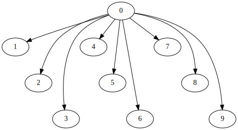

The method returns a :class:`.Source` object that you can
:meth:`~.Source.render`, :meth:`~.Source.view`, etc. with the same API
(minus modification, see details `below <Using raw DOT_>`_).

.. code:: python

    >>> u = w.unflatten(stagger=2)

    >>> u.view()  # doctest: +SKIP

.. image:: _static/wide-unflatten-stagger-2.svg
    :align: center

Custom DOT statements
---------------------

To add arbitrary statements to the created DOT_ source, use the
:attr:`~.Graph.body` attribute of the :class:`.Graph` or :class:`.Digraph`
object. It holds the verbatim list of lines to be written to the source file.
Use its ``append()``- or ``extend()``-method:

.. code:: python

    >>> rt = graphviz.Digraph(comment='The Round Table')

    >>> rt.body.append('\t"King Arthur" -> {\n\t\t"Sir Bedevere", "Sir Lancelot"\n\t}')
    >>> rt.edge('Sir Bedevere', 'Sir Lancelot', constraint='false')

    >>> print(rt.source)  # doctest: +NORMALIZE_WHITESPACE
    // The Round Table
    digraph {
        "King Arthur" -> {
            "Sir Bedevere", "Sir Lancelot"
        }
        "Sir Bedevere" -> "Sir Lancelot" [constraint=false]
    }

Note that you might need to correctly quote/escape identifiers and strings
containing whitespace or other special characters when using this method.

Using raw DOT
-------------

To render a ready-made DOT source code string (instead of assembling one with
the higher-level interface of :class:`.Graph` or :class:`.Digraph`), create a
:class:`.Source` object holding your DOT string:

.. code:: python

    >>> src = graphviz.Source('digraph "the holy hand grenade" { rankdir=LR; 1 -> 2 -> 3 -> lob }')

    >>> src  #doctest: +ELLIPSIS
    <graphviz.files.Source object at 0x...>

Use the :meth:`~.Source.render`-method to save and render it:

.. code:: python

    >>> src.render('test-output/holy-grenade.gv', view=True)  # doctest: +SKIP
    'test-output/holy-grenade.gv.pdf'

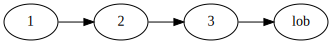

Apart from the missing editing methods, :class:`.Source` objects are the same
as the higher-level graph objects (:meth:`~.Source.pipe`-method,
:attr:`~.Source.format`, :attr:`~.Source.engine`, Jupyter notebook repr, etc.),
see above.

Existing files
--------------

To directly render an existing DOT source file (e.g. created with other tools),
you can use the :func:`graphviz.render` function. 

.. code:: python

    >>> graphviz.render('dot', 'png', 'test-output/holy-grenade.gv')  # doctest: +SKIP
    'test-output/holy-grenade.gv.png'

To directly display the graph of an existing DOT source file inside a 
Jupyter `notebook <Jupyter notebook_>`_ or `Qt Console <Jupyter Qt Console_>`_,
you can use the :meth:`.Source.from_file`-classmethod (alternate constructor):

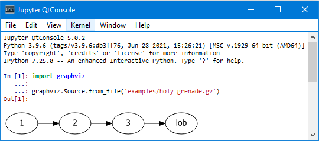

Note that if you call :meth:`~.Source.render` or :meth:`~.Source.view` on the
returned :class:`.Source` object, it will still :meth:`~.Source.save` as usual
(i.e. write the content read into :attr:`~.Source.source` back into the file).
You can use :func:`graphviz.render` and :func:`graphiz.view` to directly work
on files in case you need to avoid this round-trip.

Integration with viewers
------------------------

On platforms such as Windows, viewer programs opened by rendering with
``view=True`` or the :meth:`~.Graph.view`-method might lock the (PDF, PNG,
etc.) file for as long as the viewer is open (blocking re-rendering it with a
``Permission denied`` error). You can use the :func:`~tempfile.mktemp` function
from the stdlib :mod:`tempfile` module to render to a different file for each
invocation to avoid needing to close the viewer window each time within such an
incremental workflow (and also preserve its intermediate steps):

.. code:: python

    >>> import tempfile

    >>> g = graphviz.Graph()

    >>> g.node('spam')

    >>> g.view(tempfile.mktemp('.gv'))  # doctest: +SKIP
    'C:\\Users\\User\\AppData\\Local\\Temp\\tmp3aoie8d0.gv.pdf'

    >>> g.view(tempfile.mktemp('.gv'))  # doctest: +SKIP
    'C:\\Users\\User\\AppData\\Local\\Temp\\tmphh4ig7a_.gv.pdf'

Other options are viewers that `support live updates`_ or using the Jupyter
`notebook <Jupyter notebook_>`_ or `Qt Console <Jupyter Qt Console_>`_ to
display the current version of the rendered graph in repeated add/render/view
cycles.

.. _Graphviz: https://www.graphviz.org
.. _DOT: https://www.graphviz.org/doc/info/lang.html
.. _DOT: https://www.graphviz.org/doc/info/lang.html
.. _upstream repo: https://gitlab.com/graphviz/graphviz/
.. _upstream-download: https://www.graphviz.org/download/
.. _upstream-archived: https://www2.graphviz.org/Archive/stable/
.. _upstream-windows: https://forum.graphviz.org/t/new-simplified-installation-procedure-on-windows/224

.. _pip: https://pip.readthedocs.io
.. _virtualenv: https://virtualenv.pypa.io

.. _Anaconda: https://docs.anaconda.com/anaconda/install/
.. _conda-forge: https://conda-forge.org
.. _conda-forge-python-graphviz: https://anaconda.org/conda-forge/python-graphviz
.. _conda-forge-python-graphviz-feedstock: https://github.com/conda-forge/python-graphviz-feedstock
.. _conda-forge-graphviz: https://anaconda.org/conda-forge/graphviz
.. _conda-forge-graphviz-feedstock: https://github.com/conda-forge/graphviz-feedstock

.. _output file format: https://www.graphviz.org/doc/info/output.html
.. _appearance: https://www.graphviz.org/doc/info/attrs.html
.. _escString: https://www.graphviz.org/doc/info/attrs.html#k:escString
.. _raw string literals: https://docs.python.org/3/reference/lexical_analysis.html#string-and-bytes-literals
.. _HTML-like labels: https://graphviz.gitlab.io/_pages/doc/info/shapes.html#html
.. _unflatten: https://linux.die.net/man/1/unflatten
.. _unflatten_pdf: https://www.graphviz.org/pdf/unflatten.1.pdf
.. _Jupyter notebook: https://jupyter.org
.. _graphviz-notebook.ipynb: https://github.com/xflr6/graphviz/blob/master/examples/graphviz-notebook.ipynb
.. _nbviewer: https://nbviewer.jupyter.org/github/xflr6/graphviz/blob/master/examples/graphviz-notebook.ipynb
.. _Jupyter Qt Console: https://qtconsole.readthedocs.io
.. _spyderconsole: https://docs.spyder-ide.org/ipythonconsole.html
.. _Spyder IDE: https://github.com/spyder-ide/spyder
.. _support live updates: https://superuser.com/questions/599442/pdf-viewer-that-handles-live-updating-of-pdf-doesnt-lock-the-file
