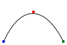

``neato`` no-op flag
--------------------

The `neato <DOT neato_>`_ layout engine
supports an additional `rendering flag <neato no-op_>`_
that allows more control over the node positioning and the edge layout
via the `pos <DOT pos_>`_,
`overlap <DOT overlap_>`_,
and `splines <DOT splines_>`_ attributes.

Use the ``neato_no_op`` keyword argument of
:meth:`~.Graph.render` or :meth:`~.Graph.pipe`
to pass it to the layout command:

.. doctest::

    >>> doctest_mark_exe()  # skip this line

    >>> import graphviz

    >>> n = graphviz.Digraph(name='splines', engine='neato',
    ...                      graph_attr={'splines': 'true'},
    ...                      node_attr={'shape': 'point'})
    >>> n.node('a', pos='0,0!', color='blue')
    >>> n.node('b', pos='100,0!', color='green')
    >>> n.node('c', pos='50,50!', color='red')
    >>> n.edge('a', 'b', pos='0,0 30,66 70,60 100,0')
    >>> n.render(neato_no_op=2, directory='doctest-output').replace('\\', '/')
    'doctest-output/splines.gv.pdf'

.. include:: _links.rst
